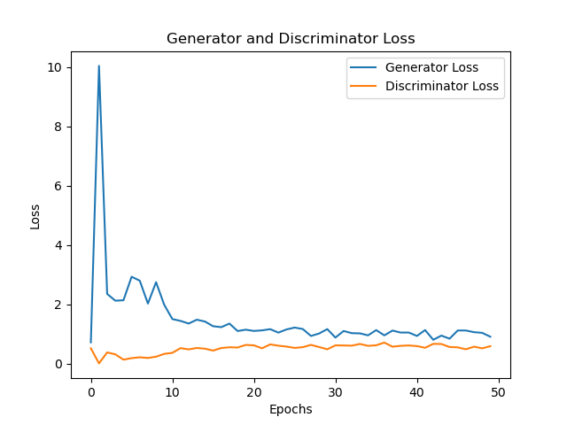
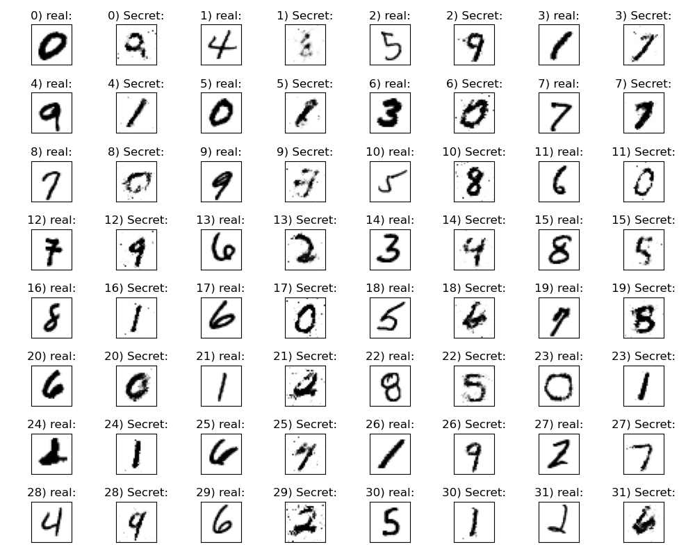

# Steganography with Generative Adversarial Networks (GANs)

Steganography is the practice of hiding secret messages in plain site. This method can be used as means for communication and also as an attack vector for cyberattacks. This work, uses generative adversarial networks (GANs) to hide "messages" as images resembling the MNIST datset.

## Installation
1. Download or clone repository locally
2. Navigate to project directory in terminal
3. Set up conda environment:
- `conda env create -f environment.yml`

## To Run
To train the GAN, run:
- `python train_secretGAN.py`

Flags include:
- `--lr`: learning rate for both the generator and descriminator
- `--epochs`: number of training epochs
- `--batch_size`: batch size of training sets

To train the GAN with one of the flags, run:
- `python train_secretGAN.py --epochs 20`

To test the GAN, run:
- `python test_secretGAN.py`

## Results
**Discriminator and Generator Training Loss**

**Messages to hide and their generated counterparts**

## Files and Directories
- *MNIST*: MNIST dataset
- *results*: result images
- *saved_models*: generator and discriminator trained networks, training info json
- `Networks.py`: Neural Network classes for the generator and descriminator
- `SecretGAN.py`: Stegaongraphy GAN class
- `train_secretGAN.py`: train the GAN
- `test_secretGAN.py`: test the network and compare results
- `train_secretGAN.ipynb`: jupyter notebook to run the training

## Notes
- Training takes a while. If just wanting to view results, run the `test_secretGAN.py`.
- The `test_secretGAN.py` is set up to run from the *saved_models* folder. If testing local training, update the *saved_models* folder.

