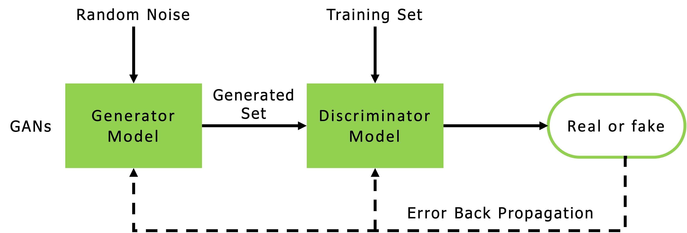

# Steganography with Generative Adversarial Networks (GANs)

Steganography is the practice of hiding secret messages in plain site. Applications include communication and attack vectors for cyberattacks. This work uses generative adversarial networks (GANs) to hide "messages" as images resembling the MNIST datset.

### GANs
Generative Adversarial Networks (GANs) consist of a generator and a discriminator. The **generator** learns how to generate unique images that resemble the original training set by learning a probability distribution of the original set during training. The generator takes in random noise, or a latent space, and outputs a generated image that resembles the original set. The goal of the generator is to generate images that can fool the discriminator into thinking the images are from the original set.

The **discriminator** learns how to distinguish between fake images and real images. It takes a set of real and generated images as an input and returns a set of labels marking the inputs as real or fake. A diagram of a GAN is shown below.

## Installation
1. Download or clone repository locally
- `git clone https://github.com/pkrobinette/robinette_cs4277_finalproject`
3. Navigate to project directory in terminal
4. Set up conda environment:
- `conda env create -f environment.yml`
5. Activate the environment:
- `conda activate gans`

## To Run
To train the GAN, run:
- `python train_secretGAN.py`

Flags include:
- `--lr`: learning rate for both the generator and descriminator
- `--epochs`: number of training epochs
- `--batch_size`: batch size of training sets

To train the GAN with one of the flags, run:
- `python train_secretGAN.py --epochs 20`

To test the GAN, run:
- `python test_secretGAN.py`

## Results
**Discriminator and Generator Training Loss**

**Messages to hide and their generated counterparts**

## Files and Directories
- *MNIST*: MNIST dataset
- *results*: result images
- *saved_models*: generator and discriminator trained networks, training info json
- `Networks.py`: Neural Network classes for the generator and descriminator
- `SecretGAN.py`: Stegaongraphy GAN class
- `train_secretGAN.py`: train the GAN
- `test_secretGAN.py`: test the network and compare results
- `train_secretGAN.ipynb`: jupyter notebook to run the training

## Notes
- Training takes a while. If just wanting to view results, run the `test_secretGAN.py`.
- The `test_secretGAN.py` is set up to run from the *saved_models* folder. If testing local training, update the *saved_models* folder.

## Resources
- https://www.youtube.com/watch?v=TWEXCYQKyDc
- https://arxiv.org/pdf/1901.03892.pdf
- https://machinelearningmastery.com/what-are-generative-adversarial-networks-gans/
- https://www.researchgate.net/publication/346428479_The_secure_steganography_for_hiding_images_via_GAN
- https://medium.com/ai-society/gans-from-scratch-1-a-deep-introduction-with-code-in-pytorch-and-tensorflow-cb03cdcdba0f

